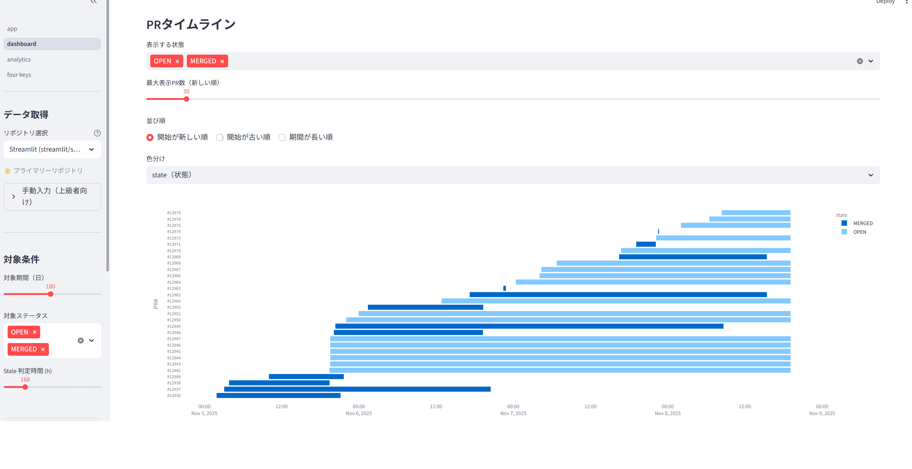

# GitHub PR Dashboard

GitHubのPull Requestを可視化・分析するダッシュボード

[](https://opensource.org/licenses/MIT)
[](https://www.python.org/downloads/)

日本語 | [English](README_EN.md)

PRの状態、レビュー状況、ボトルネックを直感的に可視化し、開発チームの生産性向上を支援します。

## 2つのバージョン

このリポジトリは2つの実装を提供しています:

1. **[Streamlit版](dashboard/)** - ローカルPC上で動作するPythonベースのダッシュボード
2. **[GitHub Pages版](Dashboard_pages/)** - GitHub Pagesで公開できる静的Webアプリケーション（推奨）

| 機能 | Streamlit版 | GitHub Pages版 |
|------|------------|------------------|
| 実行環境 | ローカルPC | クラウド（無料） |
| セットアップ | Python環境必要 | 不要（ブラウザのみ） |
| 自動更新 | 手動設定 | GitHub Actions（自動） |
| アクセス | localhost | 公開URL |
| チーム共有 | 難しい | 簡単（URLを共有） |

GitHub Pages版の使い方は [Dashboard_pages/README.md](Dashboard_pages/README.md) を参照してください。

[デモサイト (GitHub Pages)](https://hidenori24.github.io/github-pr-dashboard/) でこのリポジトリのPRダッシュボードを確認できます。

## ディレクトリ構成

```
├── Dashboard_pages/       # GitHub Pages版（静的Webアプリ）
│   ├── index.html        # メインHTMLページ
│   ├── css/              # スタイルシート
│   ├── js/               # JavaScriptロジック
│   ├── data/             # JSONデータ（自動生成）
│   ├── generate_data.py  # データ生成スクリプト
│   └── README.md         # Pages版のドキュメント
│
└── dashboard/            # Streamlit版（ローカル実行）
    ├── app.py            # メインエントリーポイント
    ├── pages/
    │   ├── 1_dashboard.py    # PRタイムライン可視化
    │   ├── 2_analytics.py    # PR統計分析
    │   └── 3_four_keys.py    # Four Keys指標
    ├── fetch_data.py     # データ取得スクリプト
    ├── config.py         # 設定ファイル
    ├── fetcher.py        # GitHub API呼び出し
    ├── db_cache.py       # SQLiteキャッシュ管理
    ├── action_tracker.py # アクション追跡
    └── pr_cache.db       # キャッシュDB(自動生成)
```

## クイックスタート

### 必要なパッケージ

```bash
pip install -r requirements.txt
```

### GitHub Tokenの設定

```bash
$env:GITHUB_TOKEN="your_token_here"
```

### 初回セットアップ

```bash
# データ取得
python dashboard/fetch_data.py --all

# ダッシュボード起動
cd dashboard
streamlit run app.py
```

詳細なドキュメントは `dashboard/README.md` を参照してください。

## 主な機能

- **マルチリポジトリ対応**: 複数のリポジトリを一元管理
- **PRタイムライン**: ガントチャートで視覚的にPRの進行状況を把握
- **ボトルネック分析**: レビュー待ち・修正待ちPRを自動検出（営業日ベース）
- **レビュワー分析**: 誰がレビューに応答していないかを特定
- **コメントスレッド分析**: 指摘→返信→解決の流れを追跡
- **高速表示**: ローカルキャッシュで0.1秒以下の表示速度

## スクリーンショット

### PRタイムライン



PRの作成から完了までの時系列をガントチャートで可視化。状態（OPEN/MERGED）、作成日時、期間を一目で把握できます。

## ライセンス

MIT License - 詳細は [LICENSE](LICENSE) を参照してください。

## 貢献

バグ報告や機能リクエストは [Issues](../../issues) で受け付けています。
プルリクエストも歓迎します。

